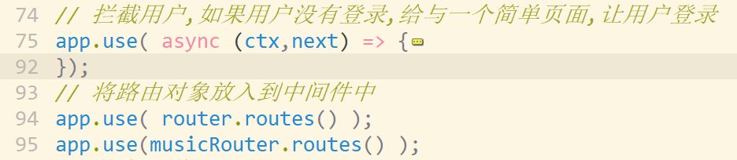

#### 项目中涉及的新坑

1. 登录前后要有不同显示,模板引擎与koa通信时的数据交互__ctx.state
2. 回写到客户端的base64编码还能进行解码,不安全,需要sessionStore
3. 静态文件将/public目录下的资源暴露,如:/css/xx.css ,与前端url:  /public 矛盾,需要重写url
4. 播放音乐的时候audio标签接收到static中间件响应的头不标准,需要通过setHeaders函数来完善其头部
   1. 前端代码滚动歌词的实现在views/index.html:81  ,主要分为几个步骤
      1. ajax请求歌词字符串,并解析成__{ 秒数:歌词 }__ 对象
      2. 通过 __{ 秒数:歌词 }__ 生成歌词DOM __
歌词</[p>__
      3. 滚动时获取 audio播放事件,取秒,   查找DOM中p 相同秒的__元素的top值__
      4. 获取p与父容器间的top差, 从而得之该父容器要上移的距离

#### session配置

#### 总结

* 登录和注册
* session是难点 ..实际应用,照抄就可以了 
  * 扩展: koa-seession  机制中默认不包含 session数据,cookie作为标识来取(express包含)
  * 不配置store  就会将数据作为cookie来发送,不安全
    * cookie以外的存储数据: 1: 内存 /  2:存储在数据库中
* 首页的显示||添加页面||....
  * 需要判断用户是否登录
    * 将统一操作配置在中间件中完成
    * 但是中间件配置的位置要注意顺序
    * 
* 上传音乐
  * 选择工具中的form-data,   建议大家基础不是太好的情况,先不必管__拦截登录和session服务器存储__

