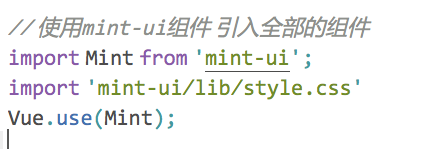
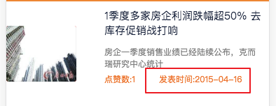
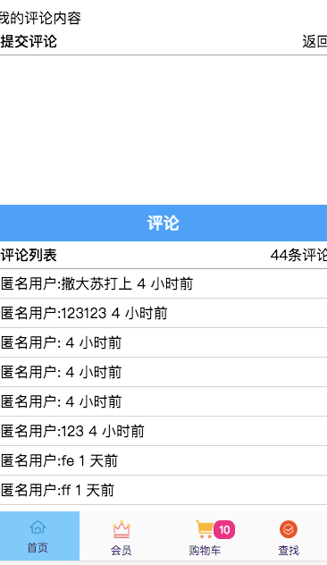
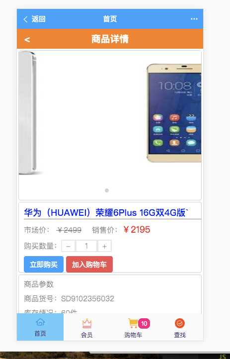
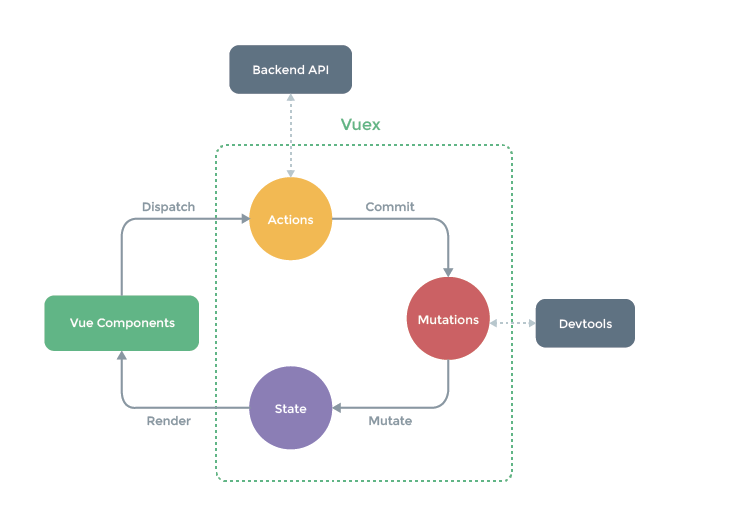
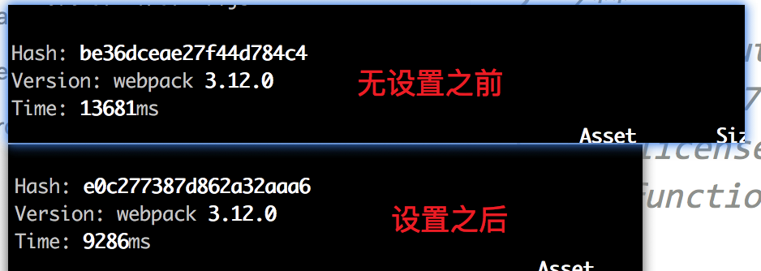
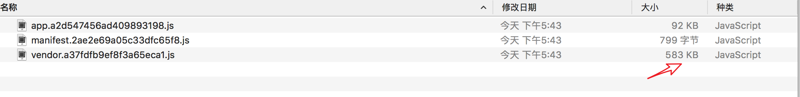
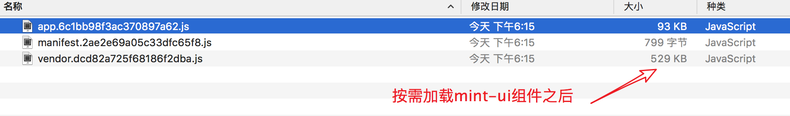
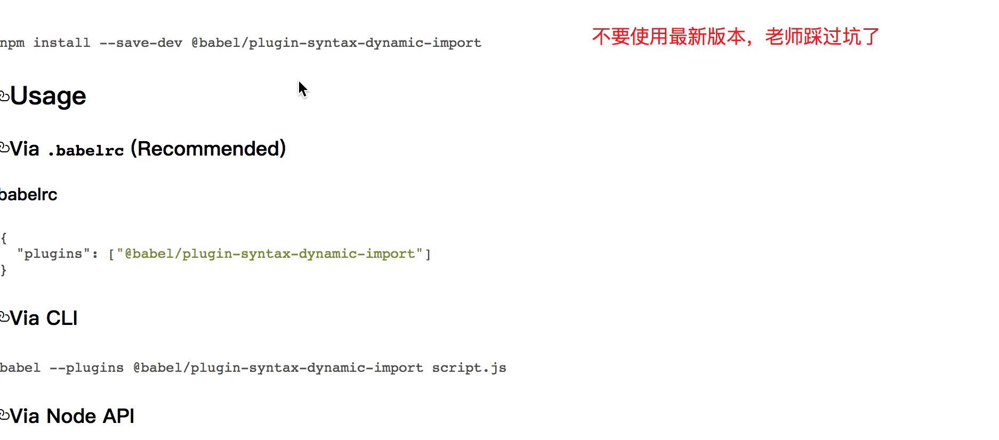

#### vue项目中assets和static的区别

官方说法：

##### webpack assets

 在*.vue` 组件中，所有模板和CSS都会被 `vue-html-loader` 及 `css-loader` 解析，并查找资源URL。例如，在 ``` 和 `background: url(./logo.png)` 中，`"./logo.png"` 是相对的资源路径，将由**Webpack解析为模块依赖**。

因为 `logo.png` 不是 JavaScript，当被视为模块依赖时，需要使用 `url-loader` 和 `file-loader` 处理它。vue-cli 的 webpack 脚手架已经配置了这些 loader，因此可以使用相对/模块路径。

由于这些资源可能在构建过程中被内联/复制/重命名，所以它们基本上是源代码的一部分。这就是为什么建议将 Webpack 处理的静态资源放在 `/src` 目录中和其它源文件放一起的原因。事实上，甚至不必把它们全部放在 `/src/assets`：可以用`模块/组件`的组织方式来使用它们。例如，可以在每个放置组件的目录中存放静态资源。

##### "Real" Static Assets

相比之下，`static/` 目录下的文件并不会被 Webpack 处理：它们会直接被复制到最终目录（默认是`dist/static`）下。必须使用绝对路径引用这些文件，这是通过在 `config.js` 文件中的 `build.assetsPublicPath` 和 `build.assetsSubDirectory` 连接来确定的。

任何放在 `static/` 中文件需要以绝对路径的形式引用：`/static/[filename]`。如果更改 `assetSubDirectory` 的值为 `assets`，那么路径需改为 `/assets/[filename]`。

自己总结：

区别一：assets文件是src下的，所以最后运行时需要进行打包，而static文件不需要打包就直接放在最终的文件中了

区别二：assets中的文件在vue中的template/style下用../这种相对路径的形式进行引用，在script下必须用import的方式引入，而static下的文件在**.vue中的任何地方都只要使用../这种相对路径的方式引入**，

 

#### 项目准备

##### 1、项目初始化

- vue init webpack cms_project
- cd cms_project
- npm run dev
- 本项目是依赖了饿了么团队提供的mint-ui框架
- npm install mint-ui -S


##### 项目第一天

基本的单页面搭建


在main.js中做如下配置：



轮播图使用的是mint-ui中的Swipe组件

###### 新闻资讯中

​	|-- 新闻列表

​		|--新闻详情实现

详情请看录播视频和课上代码

###### 过滤器的使用

```javascript
import Moment from 'moment'
// 自定义过滤器
Vue.filter('formatTime',function(data,formatStr){

	return Moment(data).format(formatStr);
});
```





主要考察：

- vue+vue-router创建单页面应用	

- axios技术在生命周期的请求时机

- 数据驱动视图—  vue中的插值语法、指令系统v-for等

  


##### 项目第二天

###### 图文列表实现


*** 图片懒加载的使用使用了mint-ui中Lazy-load组件***

###### 图文详情实现

使用vue-preview模块使用图片的预览

npm i vue-preview -S

详情使用：https://www.npmjs.com/package/vue-preview


##### 项目第三天

###### 图文介绍评论列表实现



1.实现了提交评论信息

2.实现加载更多按钮获取更多评论


##### 项目第四天

商品列表展示


使用过滤器控制标题文本内容的展示

```javascript
// 控制字数显示的过滤器
Vue.filter('controllShow',function(str,num) {

	// 如果当前字符串小于num,返回原值
	if (str.length  <= num) {
		return str;
	}
	// 如果当前字符串大于num，截取 0 ~num-1位
	if (str.length > num) {
		return str.substr(0,num-1) + '...';
	}

});
```

###### 图片详情实现



###### 商品图文介绍


##### 项目第六天

###### 各组件之间淡入淡出效果

在App.vue组件

```html
 <transition name = 'fade'>
        <router-view></router-view>
</transition>
```

```css
.fade-enter-active, .fade-leave-active {
  transition: opacity .5s;
}
.fade-enter, .fade-leave-to /* .fade-leave-active below version 2.1.8 */ {
  opacity: 0;
}
```

但会发现切入组件的时候 bug


解决：

同时生效的进入和离开的过渡不能满足所有要求，所以 Vue 提供了 **过渡模式**

- `in-out`：新元素先进行过渡，完成之后当前元素过渡离开。
- `out-in`：当前元素先进行过渡，完成之后新元素过渡进入。


##### Vuex的使用

###### vuex的基本概念

Vuex是一个专为vue.js应用程序开发的状态管理模式。

Vuex背后的基本思想，借鉴了 [Flux](https://facebook.github.io/flux/docs/overview.html)、[Redux](http://redux.js.org/)、和 [The Elm Architecture](https://guide.elm-lang.org/architecture/)。与其它模式不同的是，vuex是专门为Vuex.js设计的状态管理库，利用vue.js的数据响应机制来进行高效的状态更新



###### Vuex的使用场景

> 如果您不打算开发大型单页应用，使用 Vuex 可能是繁琐冗余的。确实是如此——如果您的应用够简单，您最好不要使用 Vuex。一个简单的 [store 模式](https://cn.vuejs.org/v2/guide/state-management.html#%E7%AE%80%E5%8D%95%E7%8A%B6%E6%80%81%E7%AE%A1%E7%90%86%E8%B5%B7%E6%AD%A5%E4%BD%BF%E7%94%A8)就足够您所需了。但是，如果您需要构建一个中大型单页应用，您很可能会考虑如何更好地在组件外部管理状态，Vuex 将会成为自然而然的选择

###### Vuex的起步

每一个 Vuex 应用的核心就是 store（仓库）。“store”基本上就是一个容器，它包含着你的应用中大部分的**状态 (state)**。Vuex 和单纯的全局对象有以下两点不同：

1. Vuex 的状态存储是响应式的。当 Vue 组件从 store 中读取状态的时候，若 store 中的状态发生变化，那么相应的组件也会相应地得到高效更新。
2. 你不能直接改变 store 中的状态。改变 store 中的状态的唯一途径就是显式地**提交 (commit) mutation**。这样使得我们可以方便地跟踪每一个状态的变化，从而让我们能够实现一些工具帮助我们更好地了解我们的应用。

###### Vuex的'五大将'

**state**

**getters**

**mutations**

**actions**

**modules**


###### 给state添加属性，开发中必遇到的坑

Mutation 需遵守 Vue 的响应规则
既然 Vuex 的 store 中的状态是响应式的，那么当我们变更状态时，监视状态的 Vue 组件也会自动更新。这也意味着 Vuex 中的 mutation 也需要与使用 Vue 一样遵守一些注意事项：

	1.最好提前在你的 store 中初始化好所有所需属性。
	2.当需要在对象上添加新属性时，你应该


``` Vue.set(state.myProps,'name',payload.name);```

// 以新对象替换老对象
``state.myProps  = {...state.myProps,name:payload.name};``


###### 项目上线之前的操作

```javascript
npm run build
```


/config

   /-index.js

```javascript
productionSourceMap: false,
```

加快打包速度，减少打包体积，依赖map文件



 

在webpack.base.conf 中添加 externals来告诉webpack我们这些第三方库不需要打包

```javascript
 externals:{
    'vue':'Vue',
    'moment':'Moment'
  }
```


##### http-server

- npm i -g http-server
- hs -o -p 8888




mint-ui中组件按需加载




##### 路由懒加载

当打包构建应用时，Javascript 包会变得非常大，影响页面加载。如果我们能把不同路由对应的组件分割成不同的代码块，然后当路由被访问的时候才加载对应组件，这样就更加高效了。

为什么需要懒加载

​      在单页应用中，如果没有应用懒加载，运用webpack打包后的文件将会异常的大，造成进入首页时，需要加载的内容过多，延时过长，不利于用户体验，而运用懒加载则可以将页面进行划分，需要的时候加载页面，可以有效的分担首页所承担的加载压力，减少首页加载用时.

结合 Vue 的[异步组件](https://cn.vuejs.org/v2/guide/components-dynamic-async.html#%E5%BC%82%E6%AD%A5%E7%BB%84%E4%BB%B6)和 Webpack 的[代码分割功能](https://doc.webpack-china.org/guides/code-splitting-async/#require-ensure-/)，轻松实现路由组件的懒加载。

> 注意
>
> 如果您使用的是 Babel，你将需要添加 [`syntax-dynamic-import`](https://www.npmjs.com/package/babel-plugin-syntax-dynamic-import) 插件，才能使 Babel 可以正确地解析语法。





- npm install babel-plugin-syntax-dynamic-import

- **.babelrc**

  ```
  {
    "plugins": ["syntax-dynamic-import"]
  }
  ```

  结合这两者，这就是如何定义一个能够被 Webpack 自动代码分割的异步组件。

  ```javascript
  const Home =() =>import('@/components/Home/Home')
  ```

  在路由配置中什么都不需要改变，只需要像往常一样使用 `Foo`：

  ```javascript
  const router = new VueRouter({
    routes: [
      { path: '/home', component: Home }
    ]
  })
  ```

  

```html
# 是在vendor基础上，再抽取出要经常变动的部分，比如异步加载js模块的内容
<script type=text/javascript src=/static/js/manifest.41e97277dd9fe013ea10.js></script>
# 通过提取公共模块插件来提取的代码块(webpack本身带的模块代码部分)
<script type=text/javascript src=/static/js/vendor.d1aca583a0d0cad0f0ee.js></script>
# 入口js文件
<script type=text/javascript src=/static/js/app.1a2c7b1a28743c679651.js></script>
```

