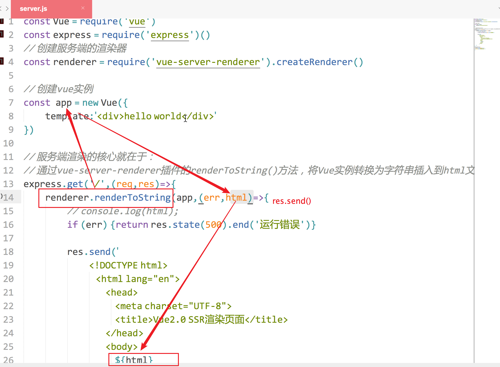
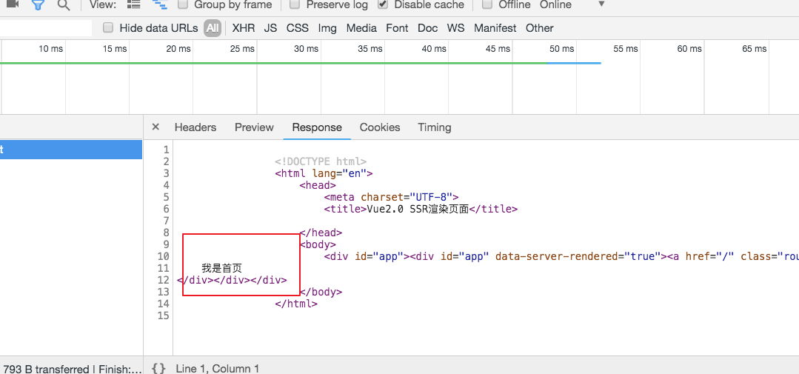
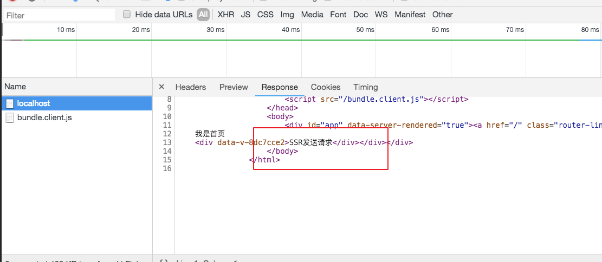
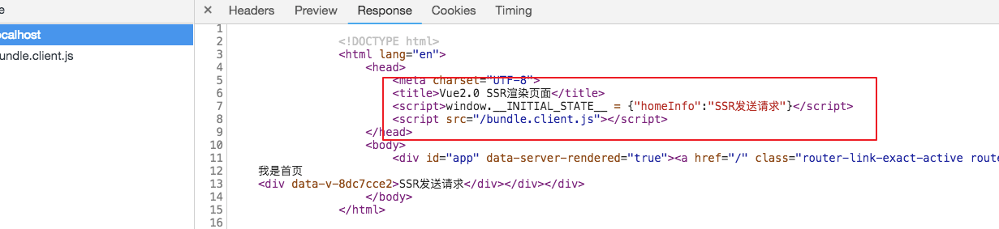
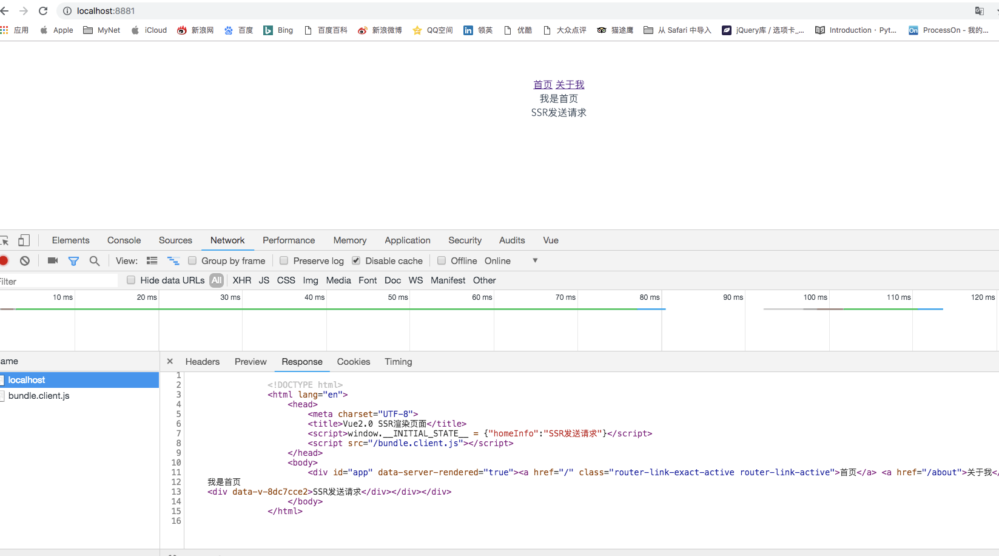

#### 预渲染(prerender-spa-plugin)

如果你调研服务器端渲染(SSR)只是用来改善少数营销页面（例如 `/`, `/about`, `/contact` 等）的 SEO，那么你可能需要**预渲染**。无需使用 web 服务器实时动态编译 HTML，而是使用预渲染方式，在构建时(build time)简单地生成针对特定路由的静态 HTML 文件。优点是设置预渲染更简单，并可以将你的前端作为一个完全静态的站点


#### 服务端渲染（SSR）（vue-server-renderer）

##### 什么是服务端渲染 

 Vue.js 是构建客户端应用程序的框架。默认情况下，可以在浏览器中输出 Vue 组件，进行生成 DOM 和操作 DOM。然而，也可以将同一个组件渲染为服务器端的 HTML 字符串，将它们直接发送到浏览器，最后将这些静态标记"激活"为客户端上完全可交互的应用程序。

有助于大家更好的理解SSR

- npm init --yes

- npm i vue express vue-server-renderer -S

创建server.js文件

```javascript
const Vue = require('vue')
const express = require('express')()
const renderer = require('vue-server-renderer').createRenderer()

// 创建vue实例
const  app = new Vue({
	template:`<div>hello world</div>`
})

// 服务端渲染的核心就在于：
// 通过vue-server-renderer插件的renderToString()方法，将Vue实例转换为字符串插入到html文件
express.get('/',(req,res)=>{
	renderer.renderToString(app,(err,html)=>{
		// console.log(html);
		if (err) {return res.state(500).end('运行错误')}

		res.send(`
			<!DOCTYPE html>
		            <html lang="en">
		                <head>
		                    <meta charset="UTF-8">
		                    <title>Vue2.0 SSR渲染页面</title>
		                </head>
		                <body>
		                    ${html}
		                </body>
		            </html>`
			)
	})
})
// 服务器监听地址
express.listen(8080, () => {
    console.log('服务器已启动！')
})
```




ssr文件夹目录结构：

```
/* ssr目录结构 */
| - node_modules
  - package.json
  - package-lock.json
  - server.js
```

启动服务

```javascript
node server.js
```

总结：

服务端渲染的核心就在于：**通过vue-server-renderer插件的renderToString()方法，将Vue实例转换为字符串插入到html文件**。

 **我们使用服务端渲染是为了弥补单页面应用SEO能力不足的问题**
因此，实际上我们第一次在浏览器地址栏输入url，并且得到返回页面之后，所有的操作仍然是单页面应用在控制。我们所做的服务端渲染，只是在平时返回的单页面应用html上增加了对应路由的页面信息，好让爬虫获取到而已**

明白了这一点，我就可以将项目一分为二，也就是分为服务端渲染和客户端渲染。服务端渲染就是项目一所做的，根据vue实例获取对应路由的seo信息，然后添加到返回的单页面应用html上；客户端渲染就是平时我们所熟悉的单页面应用，


npm init webpack vue-ssr

- cd vue-ssr
- npm install vue-server-renderer -S

- 在项目根目录下创建一个服务端server.js文件

  ```javascript
  /* server.js */
  const exp = require('express')
  const express = exp()
  const renderer = require('vue-server-renderer').createRenderer()
  const createApp = require('./dist/bundle.server.js')['default']
  // 响应路由请求
  express.get('*', (req, res) => {
      const context = { url: req.url }
      // 创建vue实例，传入请求路由信息
      createApp(context).then(app => {
          renderer.renderToString(app, (err, html) => {
              if (err) { return res.state(500).end('运行时错误') }
              res.send(`
                  <!DOCTYPE html>
                  <html lang="en">
                      <head>
                          <meta charset="UTF-8">
                          <title>Vue2.0 SSR渲染页面</title>
                      </head>
                      <body>
                          <div id="app">${html}</div>
                      </body>
                  </html>
              `)
          })
      }, err => {
          if(err.code === 404) { res.status(404).end('所请求的页面不存在') }
      })
  })
  
  
  // 服务器监听地址
  express.listen(8881, () => {
      console.log('服务器已启动！')
  })
  ```

  

  配置路由规则、服务端渲染入口文件

  在/components下创建Home.vue、About.vue组件

  ```html
  /*Home.vue*/
  <template>
  	<div>
  		我是首页
  	</div>
  </template>
  
  <script>
  export default {
  
    name: 'Home',
  
    data() {
      return {
  
      };
    },
  };
  </script>
  
  <style lang="css" scoped>
  </style>
  
  ```

  ```php+HTML
  /*About.vue*/
  <template>
  	<div>
  		关于我页面
  	</div>
  </template>
  
  <script>
  export default {
  
    name: 'Home',
  
    data() {
      return {
  
      };
    },
  };
  </script>
  
  <style lang="css" scoped>
  </style>
  
  ```

  路由配置文件/router/index.js

  ```javascript
  import Vue from 'vue'
  import Router from 'vue-router'
  // import HelloWorld from '@/components/HelloWorld'
  const Home = ()=>import('@/components/Home')
  
  Vue.use(Router)
  export function createRouter (){
       // 要记得增加mode属性，因为#后面的内容不会发送至服务器，服务器不知道请求的是哪一个路由
      mode:"history",
  	return new Router({
  			  routes: [
  			    {
  			      path: '/',
  			      name: 'Home',
  			      component: Home
  			    }
  			  ]
  	})
  
  
  }
   
  ```

  路由配置要记得加上 mode: 'history' 这个配置选项，因为默认的路由方式是通过#后面的数据变化来实现路由跳转的。而#后面的数据是不会发送给服务器的，因此服务端收到的永远是根文件index.html的资源请求，这样就无法根据路由信息来进行服务端渲染了

  /src/main.js

  ```javascript
  
  import Vue from 'vue'
  import App from './App'
  // import router from './router'
  import {createRouter} from './router'
  
  Vue.config.productionTip = false
  
  /* eslint-disable no-new */
  //确保每次请求都是最新的实例化对象，使用工厂函数的方式
  export function createApp(){
  	const router = createRouter();
  	const app = new Vue({
  	  // el: '#app',
  	  router,
  	  components: { App },
  	  template: '<App/>'
  	})
  	return { app }
  
  }
  ```

  

  ```javascript
  /* entry-server.js*/
  import { createApp } from './main'
  
  
  export default context => {
    return new Promise((resolve, reject) => {
  
      const { app } = createApp()
      const router = app.$router
  
      const { url } = context
      const { fullPath } = router.resolve(url).route
  
      if (fullPath !== url) {
        return reject({ url: fullPath })
      }
  	//更改路由
      router.push(url)
  
      // wait until router has resolved possible async hooks
      router.onReady(() => {
          const matchedComponents = router.getMatchedComponents()
          // no matched routes
          if (!matchedComponents.length) {
            return reject({ code: 404 })
          }
          resolve(app)
        }, reject)
    })
  }
  
  ```

  为了保证同步，使用promise函数来处理。当调用这个函数时，会创建一个新的vue实例，然后通过路由的push()方法，来更改实例的路由状态。更改完成后获取到该路由下将加载的组件，根据所得组件的长度来判断该路由页面是否存在。

  

  在build文件夹下 创建一个服务端打包的资源配置文件 build/webpack.server.config.js

  ```javascript
  const webpack = require('webpack')
  const merge = require('webpack-merge')
  //引入的是webpack的主要配置文件
  const base = require('./webpack.base.conf')
  module.exports = merge(base,{
  	target:'node',
  	entry:"./src/entry-server.js",
  	output: {
  	    filename: 'bundle.server.js',
  	    libraryTarget: 'commonjs2'
    	},
    	plugins:[
    	]
  })
  ```

  **记得在webpack.base.conf.js中将entry的配置注释掉，为后续客户端打包的webpack文件共享。**

  打包文件并开启服务器：

  ```javascript
  npm run server
  node server
  ```

  

  可以看到，服务器返回的html文件中，已经有了对应页面的SEO信息了

  但是，我们还没成功，因为现在返回过来的只是一个页面的对应信息，并且如果切换至另一个路由就会重新向服务端发起请求，获取页面，还处于web1.0时代。这是因为我们的单页面应用没有加载导致的，下面我们就来配置单页面应用，并将它引入到返回的html页面当中。

  

  客户端渲染部分

  在build文件夹中创建webpack.client.config.js客户端配置文件

  在src文件夹中创建entry-client.js客户端入口文件

  entry-client.js

  ```javascript
  /* entry-client.js */
  import { createApp } from '../src/main'
  
  
  const app = createApp()
  
  // 绑定app根元素
  window.onload = function() {
       app.$mount('#app')
  }
  ```

  提到一个小技巧，就是要在window加载完成后再绑定app根元素启动应用，这个要结合服务端返回的html页面一起看

  ```javascript
  /* server.js */
  const exp = require('express')
  const express = exp()
  const renderer = require('vue-server-renderer').createRenderer()
  const createApp = require('./dist/bundle.server.js')['default']
  // console.log(createApp('/'));
  
  // 设置静态文件目录
  +++ express.use('/', exp.static(__dirname + '/dist'))
  
  
  +++ const clientBundleFileUrl = '/bundle.client.js'
  
  
  // 响应路由请求
  express.get('*', (req, res) => {
      const context = { url: req.url }
      console.log(createApp(context));
      // 创建vue实例，传入请求路由信息
      createApp(context).then(app => {
          renderer.renderToString(app, (err, html) => {
              if (err) { return res.state(500).end('运行时错误') }
              res.send(`
                  <!DOCTYPE html>
                  <html lang="en">
                      <head>
                          <meta charset="UTF-8">
                          <title>Vue2.0 SSR渲染页面</title>
   +++                   <script src="${clientBundleFileUrl}"></script>
                      </head>
                      <body>
                          ${html}
                      </body>
                  </html>
              `)
          })
      }, err => {
          if(err.code === 404) { res.status(404).end('所请求的页面不存在') }
      })
  })
  
  
  // 服务器监听地址
  express.listen(8881, () => {
      console.log('服务器已启动！')
  })
  ```

  这里的改动，主要在于head下面增加了一个脚本标签，用于引入我们的单页面应用，这点和平时我们使用单页面应用的方法一样

  **需要特别注意的是**：一般script标签我们都会放置在body标签内的最下方，来防止长时间的白屏，但是如果这里也这样做，会发现进入页面后会看到大量没有样式的SEO内容，短暂的延迟后，由于script文件的加载完毕，会闪屏至正常的有样式的页面，这样用户的体验非常不好。因此我们将脚本标签放在head中先加载，并且设置window的onload事件，当body的内容加载完毕后再触发脚本，虽然有了白屏时间，但是时间短暂，用户体验相比之下会更好

  webpack.client.config.js

  ```javascript
  const webpack = require('webpack')
  const path = require('path');
  function resolve (dir) {
    return path.join(__dirname, '..', dir)
  }
  
  module.exports  = {
  	entry:"./src/entry-client.js",
  	output: {
               path: path.resolve(__dirname,'../dist'),
       	    publicPath: '/dist/',
  	    filename: 'bundle.client.js'
    	},
    	plugins:[
    		// new VueSSRServerPlugin()
    	],
    	resolve: {
  	    extensions: ['.js', '.vue', '.json'],
  	    alias: {
  	      'vue$': 'vue/dist/vue.esm.js',
  	      '@': resolve('src'),
  	    }
  	  },
    	module:{
    		rules: [
    			  {
  		        test: /\.vue$/,
  		        loader: 'vue-loader',
  		         options: {
  		          compilerOptions: {
  		            preserveWhitespace: false
  		          }
  		        }
  		      },
  		      {
  		        test: /\.js$/,
  		        loader: 'babel-loader',
  		        include: [resolve('src'), resolve('test'), resolve('node_modules/webpack-dev-server/client')]
  		      }
  
    		]
    	}
  }
  
  ```

  大同小异，老师踩过坑，这里如果有webpack.base.config.js的文件配置，还是不能实现我们的效果。于是乎，我就自己手写了一个。

  

  虽然我们已经进入了about页面，但是html页面仍然是最初进入的home的SEO信息，这说明我们正在使用单页面应用，没有再经过服务器端的渲染了

  请求任意路由页面，可以得到相关的SEO信息，并且返回给我们的是一个单页面应用，我们可以在上面高性能的切换路由或者进行别的操作，而不必浪费大量的资源再次请求服务器了

  

  > 我的项目已经初具规模，但是还缺少了一个重要的东西。聪明的你可能已经想到了，我们现在虽然能够得到SEO信息，但是都是我们写死的静态页面的信息，动态从服务器请求的数据并没有获取到，项目三将完成这一重要功能，实现完全的服务端渲染

  ##  思路

  话分两头说，这里我们也是分服务端和客户端两边来说，先说说服务端
  服务端需要在渲染阶段前获取到相关的请求信息，然后将信息写入到vue实例当中，再通过vue渲染器渲染成字符串，插入到html文件中.

  entry-server.js

  ```javascript
  /*entry-server.js*/
  import { createApp } from './main'
  export default context => {
    return new Promise((resolve, reject) => {
  
      const { app } = createApp()
      const router = app.$router
  
      const { url } = context
      const { fullPath } = router.resolve(url).route
  
      if (fullPath !== url) {
        return reject({ url: fullPath })
      }
  	 // 更改路由
      router.push(url)
      router.onReady(() => {
        // 获取相应路由下的组件
        const matchedComponents = router.getMatchedComponents()
        // 没有路由匹配 则返回状态码
        if (!matchedComponents.length) {
          return reject({ code: 404 })
        }
        // 遍历路由下所以的组件，如果有需要服务端渲染的请求，则进行请求
        Promise.all(matchedComponents.map( component  => {
          if (component.serverRequest) {
             //未来各组件中如果有serverRequest对象 判断是否需要服务端请求数据，并传入一个store参数
            return component.serverRequest(app.$store)
          }
        })).then(() => {
          context.state = app.$store.state;
          resolve(app)
        }).catch(reject)
      }, reject)
    })
  }
  
  ```

  增加了一个Promise.all函数，将异步的请求变为同步状态，当我们指定的任务执行完毕后，vue实例才算是创建完成
  我们遍历请求路由下的组件，通过是否有serverRequest这个函数来判断是否需要服务端请求数据，如果需要则执行这个函数，并传入一个store参数，store是vue的Vuex的状态管理参数，下面是它的代码：

  

```javascript
/* /store/index.js */
import Vue from 'vue'
import Vuex from 'vuex'
import axios from 'axios'

Vue.use(Vuex)

export  function createStore() {
      let store =  new Vuex.Store({
            state: {
                  homeInfo: ''
            },
            actions: {
                  getHomeInfo({ commit }) {
                        return axios.get('http://localhost:8881/api/getHomeInfo').then((res) => {
                              commit('setHomeInfo', res.data)
                        })
                  }
            },
            mutations: {
                  setHomeInfo(state, res) {
                        state.homeInfo = res
                  }
            }
      })

      return store
}
```

通过Vue的axios来发起请求


更改后的main.js,引入store进入vue实例

```javascript

import Vue from 'vue'
import App from './App'
// import router from './router'
import {createRouter} from './router'
+++ import {createStore} from './store'


Vue.config.productionTip = false

/* eslint-disable no-new */
export function createApp(){
	const router = createRouter();
	const store = createStore();

	const app = new Vue({
+++	  store,
	  router,
	  components: { App },
	  template: '<App/>'
	})
	return { app }

}
```

服务器代码更改：增加一个处理‘/api/getHomeInfo’请求的函数

```javascript
/* server.js */
const exp = require('express')
const express = exp()
const renderer = require('vue-server-renderer').createRenderer()
const createApp = require('./dist/bundle.server.js')['default']

// 设置静态文件目录
express.use('/', exp.static(__dirname + '/dist'))


const clientBundleFileUrl = '/bundle.client.js'

// getHomeInfo请求
express.get('/api/getHomeInfo', (req, res) => {
    res.send('SSR发送请求')
})
// 响应路由请求
express.get('*', (req, res) => {
    const context = { url: req.url }
    // 创建vue实例，传入请求路由信息
    createApp(context).then(app => {
        renderer.renderToString(app, (err, html) => {
            if (err) { return res.state(500).end('运行时错误') }
            res.send(`
                <!DOCTYPE html>
                <html lang="en">
                    <head>
                        <meta charset="UTF-8">
                        <title>Vue2.0 SSR渲染页面</title>
                        <script src="${clientBundleFileUrl}"></script>
                    </head>
                    <body>
                        ${html}
                    </body>
                </html>
            `)
        })
    }, err => {
        if(err.code === 404) { res.status(404).end('所请求的页面不存在') }
    })
})


// 服务器监听地址
express.listen(8881, () => {
    console.log('服务器已启动！')
})
```

更改后的Home.vue

写了一个serverRequest函数，用于告诉服务端，让服务端来请求数据，然后通过监听store中的数据来获取参数。

**为什么要用store来发起请求呢？**

服务端和客户端是两个vue实例各自进行自己的渲染，然后拼接在一起的，通过serverRequest发出的请求只有服务端的vue实例可以拿到这个store数据，而客户端的vue实例是拿不到的，

```javascript
<template>
	<div>
		我是首页
		<div>{{ homeInfo }}</div>
	</div>
</template>

<script>
export default {

  name: 'Home',

  data() {
    return {

    };
  },
  serverRequest(store) {
            return store.dispatch('getHomeInfo')
   },
  computed:{
  	homeInfo(){
  		return this.$store.state.homeInfo
  	}
  }
};
</script>

<style lang="css" scoped>
</style>

```



请求路由返回的html文件中，明明是有 'SSR发送请求的' 字样的，说明我们的服务端请求并且渲染到html文件上已经成功了，但是**页面上为什么不显示呢？**

> 这是因为客户端的Vue实例脚本加载成功后。{{homeInfo}}被客户端的homeInfo属性覆盖，而客户端的homeInfo是没有值的，是个空的值，因此不显示

**那么怎么解决这个问题呢？**

> 普通的办法就是像一般的单页面应用一样，加载到这个组件时，去请求下数据，然后将数据渲染到页面上，对于单页面这是正确的办法，但是对于我们服务端渲染的应用则不然。我们在服务器上已经请求过一次了，再请求一次会浪费多余的资源，所以我们就用到了vue的状态管理

但是服务端和客户端是两个不同的vue实例，store是不相通的。但是我们可以通过一个```__INITIAL_STATE__```属性来架起一座链接服务器端和客户端之间的桥梁，让他们的数据相互贯通。

看一下服务端server.js代码,收到客户端对服务器端发出的任意路由信息，然后将路由信息放入到context对象中，传给vue实例创建器用来创建vue的实例，我们借用的就是context属性

```javascript
express.get('*', (req, res) => {
    const context = { url: req.url }
    // 创建vue实例，传入请求路由信息
    createApp(context).then(app => {
        renderer.renderToString(app, (err, html) => {
            if (err) { return res.state(500).end('运行时错误') }
            res.send(`
                <!DOCTYPE html>
                <html lang="en">
                    <head>
                        <meta charset="UTF-8">
                        <title>Vue2.0 SSR渲染页面</title>
```

再次更改之后的entry.server.js代码

```javascript
import { createApp } from './main'

export default context => {
  return new Promise((resolve, reject) => {

    const { app } = createApp()
    const router = app.$router

    const { url } = context
    const { fullPath } = router.resolve(url).route

    if (fullPath !== url) {
      return reject({ url: fullPath })
    }

    router.push(url)
    router.onReady(() => {
      const matchedComponents = router.getMatchedComponents()
      if (!matchedComponents.length) {
        return reject({ code: 404 })
      }
      
      Promise.all(matchedComponents.map( component  => {
        if (component.serverRequest) {
          return component.serverRequest(app.$store)
        }
      })).then(() => {
      context.state = app.$store.state; //更改的代码
        resolve(app)
      }).catch(reject)
    }, reject)
  })
}

```

将路由匹配下的组件的serverRequest函数执行一圈后，服务端vue实例的store已经改变了自己的状态，里面的state属性也不再是默认为空的状态了，此时我们将这个已经收获满满果实的state属性赋值给context对象，然后改造server.js文件：

```javascript
/* server.js */
const exp = require('express')
const express = exp()
const renderer = require('vue-server-renderer').createRenderer()
const createApp = require('./dist/bundle.server.js')['default']
// console.log(createApp('/'));

// 设置静态文件目录
express.use('/', exp.static(__dirname + '/dist'))


const clientBundleFileUrl = '/bundle.client.js'

// getHomeInfo请求
express.get('/api/getHomeInfo', (req, res) => {
    res.send('SSR发送请求')
})


// 响应路由请求
express.get('*', (req, res) => {
    const context = { url: req.url }
    // 创建vue实例，传入请求路由信息
    createApp(context).then(app => {
        //context.state属性转为字符串赋值给它，然后再head标签下，客户端vue脚本前，增加一个script标签，内容是，创建一个全局对象，值是state的值，这样我们就成功了一半，已经将服务端请求得出的结果传给了客户端，我们可以看下浏览器接受html文件
        let state = JSON.stringify(context.state); 
        renderer.renderToString(app, (err, html) => {
            if (err) { return res.state(500).end('运行时错误') }
            res.send(`
                <!DOCTYPE html>
                <html lang="en">
                    <head>
                        <meta charset="UTF-8">
                        <title>Vue2.0 SSR渲染页面</title>
                        <script>window.__INITIAL_STATE__ = ${state}</script> //更改的代码
                        <script src="${clientBundleFileUrl}"></script>
                    </head>
                    <body>
                        ${html}
                    </body>
                </html>
            `)
        })
    }, err => {
        if(err.code === 404) { res.status(404).end('所请求的页面不存在') }
    })
})


// 服务器监听地址
express.listen(8881, () => {
    console.log('服务器已启动！')
})
```

打开浏览器查看一下结果




下面，我们将完成桥梁的最后一步，将\_\_INITIAL_STATE\_\_属性同步到客户端vue实例的store上去


更改entry.client.js,使用store的replaceState方法，同步服务端的store到客户端的store，我们看下浏览器的情况：

```javascript
/* entry-client.js */
import { createApp } from './main'

const { app} = createApp()
const router = app.$router

// 同步服务端信息
if (window.__INITIAL_STATE__) {
	app.$store.replaceState(window.__INITIAL_STATE__);
}

window.onload = function() {
	app.$mount('#app')
}
```

到此结束，打开浏览器快看一下吧。说心里话同学们，好一个坑，花了一天一夜，diy了一个ssr服务器渲染的过程，遇到过很多坑，只要大家有耐心，没有事情是解决不了的。

